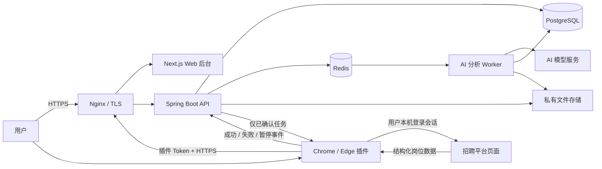

# AI-JobPilot-Cloud 总体架构设计

本文定义“投递牛马 SaaS 云端版”第一版的系统边界。核心原则是：云端管理资料、分析结果和经过确认的任务；招聘网站的采集与投递只发生在用户自己的 Chrome/Edge 中。

## 1. 架构目标与非目标

### 目标

- 支持多用户注册、登录和严格的 `user_id` 数据隔离。
- 在云端统一管理简历、求职目标、岗位池、AI 匹配、投递清单、额度和审计。
- 通过最小权限浏览器插件完成岗位采集和确认后的投递。
- 把 AI 分析从同步 HTTP 请求拆为可排队、可重试、可审计的后台任务。
- 第一版可在单台服务器用 Docker Compose 落地，并为后续对象存储、水平扩容预留边界。

### 第一版不做

- 不让服务器登录 Boss、智联等招聘平台，也不保存招聘平台凭证或 Cookie。
- 不提供无确认批量投递、验证码绕过、风控对抗或平台限制绕过。
- 不做微信登录、复杂套餐组合、分账、优惠券或多支付渠道。
- 不在第一版拆成大量微服务；优先采用“模块化单体 API + 独立 AI Worker”。

## 2. 总体组件图



PostgreSQL 是业务事实来源；Redis 只保存短期会话、限流计数、绑定码、任务通知和队列状态。即使 Redis 数据丢失，也应能依据 PostgreSQL 中的任务状态恢复未完成工作。

## 3. 组件职责

### 3.1 前端 Web 后台

建议继续使用 Next.js App Router，复用当前 `front/` 中的布局、表格、筛选、图表和确认对话框，再按 SaaS 路由重组。

主要职责：

- 注册、登录、退出、个人资料和设备管理。
- 简历上传、解析状态、删除和求职目标配置。
- 岗位池浏览、筛选、去重结果和 AI 匹配展示。
- 创建投递清单、编辑招呼语、逐条或明确批量确认、跳过任务。
- 展示插件在线状态、执行进度、失败原因、验证码/风控暂停提示。
- 展示额度和基础后台页面。

边界：Web 不直接操作招聘平台 DOM，不接收或读取招聘平台 Cookie；浏览器页面与插件通信时只传 Cloud 任务 ID 和必要业务字段。

### 3.2 后端 API 服务

建议沿用 Java 21 + Spring Boot，但将当前单用户 Controller/Mapper 重构为分层模块：

```text
auth / users
resumes / preferences
jobs / matches
delivery
plugin
quota / admin
audit / common
```

主要职责：

- Web 会话和插件 Token 鉴权。
- 从认证上下文得到当前 `user_id`，禁止信任客户端提交的 `user_id`。
- 校验请求、执行授权、控制状态流转、提供幂等接口。
- 写入 PostgreSQL，发布 AI 分析任务和插件任务通知。
- 签发短期一次性绑定码，管理插件设备和撤销。
- 计量额度、记录审计、返回统一错误结构。

第一版 API 可以是一个可水平扩展的模块化单体。AI 调用和长耗时文件解析不占用 API 请求线程。

### 3.3 PostgreSQL 数据库

PostgreSQL 保存：用户、个人资料、简历元数据与解析文本、求职目标、用户岗位池、AI 匹配、投递任务与事件、插件设备和 Token 哈希、额度流水、预留订单/订阅以及审计日志。

设计要求：

- 主键优先使用 UUID，时间统一为 `timestamptz`，服务端统一按 UTC 写入。
- 除 `users` 这个隔离根外，所有用户业务表直接包含 `user_id`。
- 所有查询和变更同时带 `id` 与 `user_id`；关联表使用包含 `user_id` 的复合外键，避免跨用户串联。
- 应用层隔离是必需项，可再启用 PostgreSQL Row Level Security 作为纵深防御。
- Flyway 迁移不可直接复用当前 SQLite SQL，必须新建 PostgreSQL 基线迁移。

详见 `CLOUD_DATABASE_DESIGN.md`。

### 3.4 Redis 缓存与任务队列

第一版建议使用 Redis 处理：

- Web Session 和注销后的会话失效。
- 插件一次性绑定码，TTL 建议 5 分钟且消费一次即删除。
- 按 IP、用户、设备和接口维度的 Rate Limit。
- AI 分析队列、重试延时和短期去重锁。
- 插件待执行任务的“有新任务”通知和短租约辅助。
- 热点只读数据的短期缓存。

建议使用 Redis Streams + Consumer Group，消息只保存业务记录 ID，不把完整简历或 Cookie 放入 Redis。Worker 收到重复消息时必须通过数据库状态和幂等键安全去重。

### 3.5 AI 分析 Worker

第一版 Worker 可复用 Spring Boot 代码库，作为独立容器和进程部署。

处理流程：

1. 从 Redis 队列读取 `job_match_id`、`user_id` 和追踪 ID。
2. 从 PostgreSQL读取该用户已授权的当前简历、求职目标和岗位。
3. 执行字段脱敏和最小化，构造带版本的 Prompt。
4. 调用配置在服务端的 AI 模型，不使用用户在浏览器中暴露的 API Key。
5. 校验结构化结果，写入评分、结论、理由、建议招呼语、模型和用量。
6. 以幂等方式扣减或回滚额度，记录失败原因并按策略重试。

网络超时和模型限流可以自动重试；输入错误、额度不足和持续格式错误进入明确失败状态，不能无限重试。

### 3.6 浏览器插件

插件是“用户本地执行器”，不是云端服务端爬虫。

主要职责：

- 使用一次性绑定码关联 Cloud 用户，安全保存服务器签发的插件 Token。
- 在用户主动打开且已登录的招聘平台页面采集必要的结构化岗位字段。
- 上传单条或批量岗位，处理重复与字段校验结果。
- 轮询或接收当前设备可执行的、已经用户确认的投递任务。
- 在用户浏览器页面中执行投递，并回传开始、成功、失败或暂停事件。
- 遇到验证码、登录失效、风控、页面结构未知或权限不足时立即停止并提示用户。

插件不得上传 Cookie、LocalStorage、SessionStorage、账号密码、浏览器历史或完整页面内容。`host_permissions` 只列 Cloud API 域名和实际支持的招聘平台域名，不使用 `<all_urls>`。

### 3.7 Nginx / HTTPS

Nginx 是公网唯一入口：

- `https://app.example.com` 路由到 Next.js Web。
- `https://api.example.com` 路由到 Spring Boot API；也可第一版用同域 `/api` 简化 CORS 和 Cookie。
- 强制 HTTPS，HTTP 只做 301 跳转。
- 配置现代 TLS、HSTS、安全响应头、请求体大小限制和反向代理超时。
- 上传接口、登录接口和插件接口设置不同限流策略。
- 不向公网暴露 PostgreSQL、Redis、Worker 管理端口或内部对象存储端口。

推荐第一版使用同站点域名，例如 Web 为 `https://app.example.com`、API 为 `https://app.example.com/api`，减少跨域会话复杂度；插件仍通过 Bearer Token 调用 API。

### 3.8 文件上传目录或对象存储

第一版可二选一，但业务接口必须通过统一 `FileStorage` 抽象：

| 方案 | 适用场景 | 要求 |
| --- | --- | --- |
| 服务器私有目录/卷 | 单机 MVP、低成本试运行 | 目录不由 Nginx 静态暴露；数据库只存随机 `storage_key`；备份、加密和删除任务可验证 |
| S3 兼容对象存储 | 正式环境或多实例 | 私有 Bucket、服务端加密、短期签名 URL、生命周期和跨域白名单 |

无论哪种方案，都要校验文件魔数、扩展名、MIME、大小和页数；随机化对象名；限制 PDF/DOCX 等明确格式；扫描恶意文件；提取文本和原文件按同一 `user_id` 授权。禁止使用可猜测的永久公开 URL。

## 4. 服务器与插件职责边界

| 能力 | 云端服务器 | 浏览器插件 |
| --- | --- | --- |
| 用户注册、登录、会话 | 负责 | 不负责 |
| 简历、求职目标、岗位池 | 加密/受控保存和查询 | 仅上传必要岗位字段 |
| AI 匹配 | 排队、调用模型、保存结果 | 不直接决定是否投递 |
| 投递清单与确认记录 | 负责，作为事实来源 | 只接收已确认任务 |
| 招聘平台账号密码 | 不接收、不保存 | 不主动索取；用户在平台官网登录 |
| 招聘平台 Cookie/会话 | 不接收、不保存 | 由浏览器原生会话本地持有，不导出 |
| 岗位页面采集 | 不直接访问招聘平台 | 在明确域名和用户浏览器中执行 |
| 投递动作 | 不登录、不点击、不批量代投 | 用户确认后在本机页面执行 |
| 验证码/风控 | 记录暂停原因、提示用户 | 立即停止，等待用户人工处理 |
| 任务状态和审计 | 负责持久化 | 回传可验证的执行事件 |

## 5. 为什么投递必须在用户浏览器中执行

1. **凭证边界更安全**：招聘平台账号、密码和 Cookie 留在用户浏览器，云端一旦泄露也不会同时暴露所有用户的平台会话。
2. **用户保持控制权**：用户能看到当前页面和将要投递的岗位，明确确认后才执行，避免 AI 建议被误当成用户授权。
3. **验证码和风控需要人工判断**：验证码、登录失效、异常提示只能在用户当前会话中由用户合规处理，服务器不得绕过。
4. **降低集中化滥用风险**：服务器不形成批量登录和集中代投能力，减少对招聘平台和用户账号的系统性风险。
5. **符合最小数据原则**：云端只接收业务所需的岗位字段和执行结果，不需要浏览器缓存、会话和完整页面数据。
6. **适配页面实际状态**：投递按钮、弹窗、简历选择和平台提示与用户当前登录环境相关，本地插件能在用户可见上下文中安全暂停。

“在用户浏览器中执行”不等于允许任意自动化。插件仍必须遵守平台规则、速率限制、用户确认和暂停机制。

## 6. 关键数据流

### 6.1 Web 登录与资料管理

```text
用户 -> Nginx -> Web/API -> Web Session(Redis)
                          -> 用户资料(PostgreSQL)
                          -> 简历私有存储 + 元数据(PostgreSQL)
```

Web 使用 `HttpOnly + Secure + SameSite` 会话 Cookie，状态变更请求执行 CSRF 校验；不把长期访问 Token 放在 `localStorage`。

### 6.2 插件绑定

```text
Web 登录用户申请绑定码
  -> API 在 Redis 保存一次性短期码
  -> 用户把绑定码输入插件
  -> 插件提交绑定码和设备信息
  -> API 创建 plugin_device 与 plugin_token 哈希
  -> 明文 Token 只返回一次并保存在 chrome.storage.local
```

绑定码过期、已使用、设备被撤销或 Token 失效时，插件必须重新绑定。

### 6.3 岗位采集与 AI 匹配

```text
用户打开招聘平台页面
  -> 插件采集结构化岗位
  -> API 按 user_id + platform + external_id/fingerprint 幂等入库
  -> 创建 job_match(PENDING)
  -> Redis 通知 AI Worker
  -> Worker 脱敏分析并写回结果
  -> Web 展示建议，不自动确认
```

### 6.4 确认与投递

```text
Web 创建待确认任务
  -> 用户编辑招呼语并确认
  -> API 记录 confirmed_at / confirmed_by
  -> 插件领取 CONFIRMED 任务并获得短租约
  -> 插件在用户浏览器执行
  -> 回传 success / fail / pause
  -> API 校验状态与租约，写 task + append-only event + audit
```

状态建议：

```text
PENDING_CONFIRMATION -> CONFIRMED -> LEASED -> EXECUTING -> SUCCEEDED
          |                |           |            |------> FAILED
          |                |           |------------> PAUSED
          |                |-----------> CANCELLED（用户撤销且尚未执行）
          |----------------------------> SKIPPED
```

插件只能领取 `CONFIRMED` 任务。`SUCCEEDED` 是终态，重复回传不得把它改回失败；领取使用租约和幂等键防止多个设备重复执行。

## 7. 部署拓扑

第一版 Docker Compose 建议包含：

```text
nginx
web
api
ai-worker
postgres
redis
```

私有文件卷可由 `api` 和 `ai-worker` 共享，正式环境改为对象存储。PostgreSQL 和 Redis 只加入内部网络；Nginx 是唯一公开 `80/443` 端口。数据库迁移使用一次性任务或 API 启动前的受控步骤，不允许多个实例并发修改结构。

## 8. 可用性、观测和恢复

- 每个请求和异步任务携带 `request_id`/`trace_id`，日志默认脱敏。
- 记录 API 延迟、5xx、登录失败、AI 队列积压、模型耗时/失败率、任务暂停原因和额度用量。
- 健康检查区分 liveness 与 readiness；数据库或 Redis 不可用时不接收新任务。
- PostgreSQL 定期备份并演练恢复；对象存储启用版本/生命周期策略；Redis 不作为唯一数据源。
- AI 和插件任务使用有限次数重试、指数退避和死信/人工处理状态。
- 发布采用数据库向前兼容迁移，先迁移、再部署、最后清理旧字段。

## 9. 当前本地版的迁移判断

### 可以复用后再云化

- Java 21/Spring Boot 工程、统一异常处理和已有测试框架。
- `SalaryParser`、岗位字段抽象、AI 结构化结果解析和优先公司逻辑。
- `DeliveryStatus` 中“待确认、成功、失败、跳过”的业务语义，但应改为英文稳定枚举和显式状态机。
- Boss/智联 content script、选择器、采集支持和现有插件测试。
- Next.js、Tailwind、Radix UI、分析表格、筛选、图表和确认弹窗。
- CI、CodeQL、Docker、Release 自动化的框架。

### 不能直接复用

- SQLite 表结构、SQLite 专用 Flyway SQL、缺少 `user_id` 的 Mapper/查询。
- `CookieService`、`cookie` 表、保存 Cookie 的 API 和相关前端操作。
- 服务端 Playwright 登录/投递、浏览器用户目录和远程点击/拖拽接口。
- 固定 `localhost:6866/8888` 的 Chrome Bridge 白名单、API 地址和消息信任模型。
- 进程内队列、无租约的异步任务、无限超时 SSE 和单机状态。
- 本地 AI Key 配置与单用户 `profile_id` 隔离方式。

这些“不能直接复用”的模块可以作为业务行为参考，但 Cloud 必须按鉴权、多用户、幂等、审计和云部署要求重新实现。
