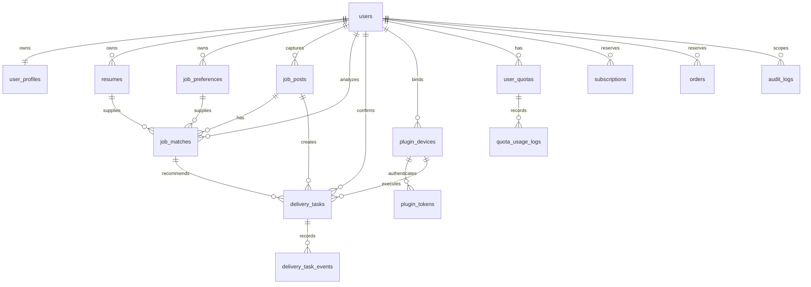

# AI-JobPilot-Cloud 第一版数据库设计

本文给出 PostgreSQL 第一版逻辑模型，供后续 Flyway 迁移和代码评审使用。本轮不创建数据库、不修改现有 SQLite 迁移。

## 1. 设计约定

- PostgreSQL 16 或当前受支持的稳定版本。
- 主键优先用 `uuid`，由应用或 PostgreSQL `gen_random_uuid()` 生成。
- 时间使用 `timestamptz`，统一按 UTC 存储，展示层转换用户时区。
- 邮箱建议启用 `citext` 扩展；若不启用，则保存标准化小写邮箱并建立 `lower(email)` 唯一索引。
- 金额使用 `numeric(12,2)`，额度和用量使用 `bigint`，不要使用浮点数。
- 可枚举状态第一版可用 `varchar + CHECK`，便于 Flyway 演进；稳定后再评估 PostgreSQL Enum。
- `jsonb` 只用于结构可变的补充字段，核心筛选、状态、归属和关联字段必须结构化。
- 业务表建议都有 `created_at`、`updated_at`；软删除表增加 `deleted_at`。
- 除 `users` 这个隔离根表外，所有用户业务表必须直接包含 `user_id`，不能只通过多层 JOIN 推导归属。

### 多用户隔离的数据库约束

应用层每次查询都必须从认证上下文取得 `user_id`，使用：

```sql
WHERE user_id = :current_user_id AND id = :resource_id
```

客户端请求中的 `user_id` 一律忽略或拒绝。每个租户表建议建立 `UNIQUE (id, user_id)`，跨表关联使用 `(foreign_id, user_id)` 复合外键，阻止把 A 用户的岗位关联到 B 用户的任务。

PostgreSQL 迁移已启用 Row Level Security（RLS）作为纵深防御：事务开始时由受控连接设置 `app.current_user_id`，策略限制 `user_id = current_setting('app.current_user_id')::uuid`。应用连接使用非 owner、非超级用户且无 `BYPASSRLS` 的独立角色；迁移 owner 不作为应用连接角色。管理员跨用户读取必须经受限接口、业务授权和审计，不能让普通应用查询默认绕过 RLS。

## 2. 核心关系



## 3. 表设计

### 3.1 `users`

用户身份与账号状态，是所有 `user_id` 的根。

| 字段 | PostgreSQL 类型 | 必填 | 说明 |
| --- | --- | --- | --- |
| `id` | `uuid` | 是 | 主键，默认 `gen_random_uuid()` |
| `email` | `citext` | 是 | 标准化邮箱，不回显完整值到日志 |
| `password_hash` | `varchar(255)` | 是 | Argon2id/BCrypt 哈希，不保存明文或可逆密文 |
| `status` | `varchar(24)` | 是 | `ACTIVE`、`LOCKED`、`DISABLED`、`PENDING` |
| `email_verified_at` | `timestamptz` | 否 | 第一版可预留，不强制做完整邮件验证 |
| `last_login_at` | `timestamptz` | 否 | 最近成功登录时间 |
| `failed_login_count` | `integer` | 是 | 默认 `0`，配合 Redis 限流而非单独依赖它 |
| `locked_until` | `timestamptz` | 否 | 临时锁定截止时间 |
| `created_at` | `timestamptz` | 是 | 默认 `now()` |
| `updated_at` | `timestamptz` | 是 | 默认 `now()`，更新时维护 |
| `deleted_at` | `timestamptz` | 否 | 账号删除流程标记 |

索引建议：`UNIQUE (email)`；`INDEX (status)`；对清理任务可建 `INDEX (deleted_at) WHERE deleted_at IS NOT NULL`。

隔离与关系：`users.id` 就是隔离根，不再增加 `user_id`。被所有用户业务表引用；业务接口只能读取当前登录用户自身记录，管理员例外必须审计。

### 3.2 `user_profiles`

用户展示资料，与登录身份一对一。

| 字段 | 类型 | 必填 | 说明 |
| --- | --- | --- | --- |
| `user_id` | `uuid` | 是 | 主键，同时 FK -> `users.id` |
| `display_name` | `varchar(80)` | 否 | 站内显示名 |
| `phone` | `varchar(32)` | 否 | 如非业务必需可不收集；存储时加密 |
| `city` | `varchar(80)` | 否 | 当前城市 |
| `timezone` | `varchar(64)` | 是 | 默认 `Asia/Shanghai`，使用 IANA 名称 |
| `locale` | `varchar(16)` | 是 | 默认 `zh-CN` |
| `avatar_storage_key` | `varchar(512)` | 否 | 私有对象键，不是公开 URL |
| `created_at` | `timestamptz` | 是 | 创建时间 |
| `updated_at` | `timestamptz` | 是 | 更新时间 |

索引建议：主键 `user_id` 已满足一对一查询；不建议给手机号建立普通可见索引，确需唯一验证时使用单独标准化哈希列。

隔离与关系：使用 `WHERE user_id = :current_user_id`；`user_id` 同时是 PK/FK，删除用户时按合规策略级联或先匿名化。

### 3.3 `resumes`

保存简历文件元数据、解析状态和受控文本。原文件位于私有卷或对象存储。

| 字段 | 类型 | 必填 | 说明 |
| --- | --- | --- | --- |
| `id` | `uuid` | 是 | 主键 |
| `user_id` | `uuid` | 是 | FK -> `users.id` |
| `original_filename` | `varchar(255)` | 是 | 清理路径字符后保存，仅用于展示 |
| `storage_key` | `varchar(512)` | 是 | 随机私有对象键，不含用户原文件名 |
| `content_type` | `varchar(100)` | 是 | 由服务端文件检测确认 |
| `file_size` | `bigint` | 是 | 字节数，必须有上限 |
| `sha256` | `char(64)` | 是 | 文件完整性和用户内去重 |
| `parse_status` | `varchar(24)` | 是 | `UPLOADED`、`PARSING`、`PARSED`、`FAILED` |
| `parse_message` | `varchar(500)` | 否 | 面向用户的脱敏失败信息 |
| `extracted_text_ciphertext` | `bytea` | 否 | AES-256-GCM 加密后的解析文本 |
| `extracted_text_nonce` | `bytea` | 否 | 每次加密随机生成的 12 字节 Nonce |
| `encryption_key_id` | `varchar(64)` | 是 | 标识解密所需 Key，不保存 Key 本身 |
| `text_version` | `integer` | 是 | 默认 `1`，便于重新解析 |
| `is_current` | `boolean` | 是 | 默认 `false`，每用户仅一份未删除当前简历 |
| `version` | `integer` | 是 | 乐观锁版本 |
| `parse_attempts` / `purge_attempts` | `integer` | 是 | Worker 有界重试计数 |
| `parse_lease_*` / `purge_lease_*` | 多种 | 否 | Worker 短租约，避免重复解析或清理 |
| `created_at` | `timestamptz` | 是 | 创建时间 |
| `updated_at` | `timestamptz` | 是 | 更新时间 |
| `deleted_at` | `timestamptz` | 否 | 删除申请时间，配合物理清理任务 |
| `purged_at` | `timestamptz` | 否 | 私有对象已物理删除时间 |

索引建议：`UNIQUE (id, user_id)`；`INDEX (user_id, created_at DESC)`；部分唯一索引 `UNIQUE (user_id) WHERE is_current AND deleted_at IS NULL`；用户内去重可建 `INDEX (user_id, sha256)`。

隔离与关系：所有读写按 `user_id`；`job_matches` 通过 `(resume_id, user_id)` 复合外键引用。删除简历时先禁止新分析，历史匹配保留最小快照或按策略匿名化，原文件与派生文本异步物理删除。

### 3.4 `job_preferences`

用户求职目标。第一版可以保留版本历史，但同一用户只有一个当前生效版本。

| 字段 | 类型 | 必填 | 说明 |
| --- | --- | --- | --- |
| `id` | `uuid` | 是 | 主键 |
| `user_id` | `uuid` | 是 | FK -> `users.id` |
| `version` | `integer` | 是 | 从 `1` 递增 |
| `is_current` | `boolean` | 是 | 是否当前生效 |
| `target_titles` | `jsonb` | 是 | 字符串数组，至少一个目标职位 |
| `cities` | `jsonb` | 是 | 城市数组，可为空数组表示不限 |
| `salary_min_k` | `numeric(8,2)` | 否 | 期望月薪下限，单位 K |
| `salary_max_k` | `numeric(8,2)` | 否 | 期望月薪上限，单位 K |
| `experience_levels` | `jsonb` | 是 | 经验范围数组 |
| `degree_levels` | `jsonb` | 是 | 学历范围数组 |
| `industries` | `jsonb` | 是 | 行业偏好数组 |
| `company_scales` | `jsonb` | 是 | 公司规模数组 |
| `preferred_companies` | `jsonb` | 是 | 优先公司数组 |
| `excluded_companies` | `jsonb` | 是 | 排除公司数组 |
| `excluded_keywords` | `jsonb` | 是 | 排除关键词数组 |
| `extra_filters` | `jsonb` | 是 | 默认 `{}`，仅放平台差异化低频字段 |
| `created_at` | `timestamptz` | 是 | 创建时间 |
| `updated_at` | `timestamptz` | 是 | 更新时间 |

索引建议：`UNIQUE (id, user_id)`；`UNIQUE (user_id, version)`；部分唯一索引 `UNIQUE (user_id) WHERE is_current`。只有确定要做数据库内 JSON 查询时才为具体 JSON 路径增加 GIN 索引。

隔离与关系：按 `user_id` 隔离；`job_matches` 通过 `(preference_id, user_id)` 引用具体版本，避免配置更新后历史结果不可解释。

### 3.5 `job_posts`

用户自己的岗位池。相同招聘平台岗位可以分别存在于不同用户空间，避免全局岗位表带来授权和删除复杂度。

| 字段 | 类型 | 必填 | 说明 |
| --- | --- | --- | --- |
| `id` | `uuid` | 是 | 主键 |
| `user_id` | `uuid` | 是 | 所属用户 |
| `platform` | `varchar(32)` | 是 | `BOSS`、`ZHILIAN` 等受控枚举 |
| `external_job_id` | `varchar(160)` | 否 | 平台岗位 ID；不可用时依赖指纹 |
| `fingerprint` | `char(64)` | 是 | 规范化公司、标题、地点、URL 等生成的 SHA-256 |
| `title` | `varchar(240)` | 是 | 岗位名称 |
| `company_name` | `varchar(240)` | 是 | 公司名称 |
| `salary_text` | `varchar(120)` | 否 | 原始薪资文本 |
| `salary_min_k` | `numeric(8,2)` | 否 | 解析后月薪下限 |
| `salary_max_k` | `numeric(8,2)` | 否 | 解析后月薪上限 |
| `salary_months` | `smallint` | 否 | 年薪月数，例如 13、14 |
| `location` | `varchar(160)` | 否 | 地点 |
| `experience` | `varchar(120)` | 否 | 经验要求 |
| `degree` | `varchar(120)` | 否 | 学历要求 |
| `description` | `text` | 否 | 岗位描述，限制长度并净化 |
| `job_url` | `text` | 是 | 只允许受支持招聘平台 HTTPS URL |
| `company_info` | `jsonb` | 是 | 默认 `{}`，行业、规模、融资等必要字段 |
| `skills` | `jsonb` | 是 | 默认 `[]` |
| `welfare` | `jsonb` | 是 | 默认 `[]` |
| `source_captured_at` | `timestamptz` | 是 | 插件实际采集时间 |
| `last_seen_at` | `timestamptz` | 是 | 最近一次重复采集时间 |
| `status` | `varchar(24)` | 是 | `ACTIVE`、`EXPIRED`、`REMOVED` |
| `created_at` | `timestamptz` | 是 | 创建时间 |
| `updated_at` | `timestamptz` | 是 | 更新时间 |

索引建议：`UNIQUE (id, user_id)`；部分唯一索引 `UNIQUE (user_id, platform, external_job_id) WHERE external_job_id IS NOT NULL`；`UNIQUE (user_id, platform, fingerprint)`；列表索引 `(user_id, created_at DESC)`、`(user_id, platform, status, last_seen_at DESC)`；按实际筛选评估 `(user_id, company_name)`。

隔离与关系：所有岗位均直接带 `user_id`；`job_matches`、`delivery_tasks` 使用包含 `user_id` 的复合外键关联。插件采集接口只把白名单字段写入岗位池，不保存原始页面载荷、Cookie、账号密码或浏览器缓存。

### 3.6 `job_matches`

保存某个岗位在指定简历和求职目标版本下的 AI 分析结果。

| 字段 | 类型 | 必填 | 说明 |
| --- | --- | --- | --- |
| `id` | `uuid` | 是 | 主键 |
| `user_id` | `uuid` | 是 | 所属用户 |
| `job_post_id` | `uuid` | 是 | 复合 FK -> `job_posts(id, user_id)` |
| `resume_id` | `uuid` | 是 | 复合 FK -> `resumes(id, user_id)` |
| `preference_id` | `uuid` | 是 | 复合 FK -> `job_preferences(id, user_id)` |
| `status` | `varchar(24)` | 是 | `PENDING`、`PROCESSING`、`SUCCEEDED`、`FAILED` |
| `score` | `smallint` | 否 | 0-100，增加 CHECK |
| `decision` | `varchar(24)` | 否 | `APPLY`、`REVIEW`、`SKIP` |
| `summary` | `text` | 否 | 匹配摘要 |
| `strengths` | `jsonb` | 是 | 默认 `[]` |
| `risks` | `jsonb` | 是 | 默认 `[]` |
| `greeting` | `text` | 否 | AI 建议招呼语，进入任务后可由用户修改 |
| `model_provider` | `varchar(64)` | 否 | 模型供应商 |
| `model_name` | `varchar(128)` | 否 | 模型名称 |
| `prompt_version` | `varchar(40)` | 是 | Prompt 版本 |
| `input_fingerprint` | `char(64)` | 是 | 岗位、简历、偏好和 Prompt 的幂等指纹 |
| `input_tokens` | `integer` | 否 | 模型用量 |
| `output_tokens` | `integer` | 否 | 模型用量 |
| `error_code` | `varchar(64)` | 否 | 脱敏错误码 |
| `error_message` | `varchar(500)` | 否 | 不含 Prompt、简历和密钥的错误摘要 |
| `started_at` | `timestamptz` | 否 | 开始时间 |
| `completed_at` | `timestamptz` | 否 | 完成时间 |
| `created_at` | `timestamptz` | 是 | 创建时间 |
| `updated_at` | `timestamptz` | 是 | 更新时间 |

索引建议：`UNIQUE (id, user_id)`；`UNIQUE (user_id, input_fingerprint)`；`INDEX (user_id, job_post_id, created_at DESC)`；Worker 索引 `(status, created_at)` 可用于恢复，但正常消费走 Redis。

隔离与关系：岗位、简历、偏好三条复合外键都包含相同 `user_id`。`delivery_tasks` 可引用成功的匹配记录；AI Worker 也只能以消息中的 `user_id + match_id` 读取。

### 3.7 `delivery_tasks`

投递清单与插件执行状态的事实表。

当前版本的 `user_profiles` 以 `user_id` 为主键，每个用户只有一份基础档案，因此 `delivery_tasks` 不重复保存 `profile_id`。任务通过 `user_id` 绑定这份一对一档案；当前新建接口始终解析并写入 `job_match_id`，从而固定本次匹配实际使用的 `resume_id` 与 `preference_id`。数据库字段仍可空以兼容早期结构，不能据此声称所有历史行都必然绑定匹配；只有未来正式支持“一个用户多份独立档案”时，才需要新增独立 `profile_id` 和迁移。

| 字段 | 类型 | 必填 | 说明 |
| --- | --- | --- | --- |
| `id` | `uuid` | 是 | 主键 |
| `user_id` | `uuid` | 是 | 所属用户 |
| `job_post_id` | `uuid` | 是 | 同用户岗位 |
| `job_match_id` | `uuid` | 否 | 关联 AI 结果；数据库保留可空兼容早期结构，当前创建接口始终解析并绑定一条已完成匹配 |
| `assigned_device_id` | `uuid` | 否 | 指定执行设备，必须属于同一用户且有效 |
| `status` | `varchar(32)` | 是 | 状态机字段 |
| `greeting` | `text` | 否 | 用户最终确认的招呼语，限制长度 |
| `confirmation_version` | `integer` | 是 | 默认 `0`，每次实质性重新确认递增 |
| `confirmed_at` | `timestamptz` | 否 | 用户明确确认时间 |
| `confirmed_by` | `uuid` | 否 | 第一版等于当前 `user_id` |
| `idempotency_key` | `varchar(100)` | 是 | 创建任务的用户级幂等键 |
| `lease_id` | `uuid` | 否 | 插件领取后生成，状态回传必须携带 |
| `leased_at` | `timestamptz` | 否 | 领取时间 |
| `lease_expires_at` | `timestamptz` | 否 | 短租约到期时间 |
| `attempt_count` | `smallint` | 是 | 默认 `0`，限制最大次数 |
| `last_error_code` | `varchar(64)` | 否 | 失败/暂停分类 |
| `last_error_message` | `varchar(500)` | 否 | 脱敏说明 |
| `started_at` | `timestamptz` | 否 | 首次开始时间 |
| `finished_at` | `timestamptz` | 否 | 成功、失败、跳过等结束时间 |
| `created_at` | `timestamptz` | 是 | 创建时间 |
| `updated_at` | `timestamptz` | 是 | 更新时间 |

现行状态：`WAITING_CONFIRM`、`CONFIRMED`、`PULLED_BY_PLUGIN`、`RUNNING`、`SUCCESS`、`FAILED`、`SKIPPED`、`PAUSED_NEED_USER`。服务层限制允许的转换，数据库 CHECK 只接受这八个值。

索引：`UNIQUE (id, user_id)`；`UNIQUE (user_id, idempotency_key_hash)`；`UNIQUE (user_id, job_match_id) WHERE job_match_id IS NOT NULL` 保证同一匹配只创建一次；活动任务部分唯一索引覆盖 `WAITING_CONFIRM`、`CONFIRMED`、`PULLED_BY_PLUGIN`、`RUNNING`、`PAUSED_NEED_USER`；列表索引 `(user_id, status, created_at DESC)`；插件领取索引 `(user_id, assigned_device_id, status, confirmed_at)`；租约恢复索引 `(lease_expires_at) WHERE status = 'RUNNING'`。

隔离与关系：岗位、匹配、设备均用带 `user_id` 的复合外键。插件 Token 的用户和设备必须同时匹配任务；插件不能自行改变 `confirmed_at`。

### 3.8 `delivery_task_events`

不可变追加的任务事件，用于时间线、排障和审计状态流转。

| 字段 | 类型 | 必填 | 说明 |
| --- | --- | --- | --- |
| `id` | `bigint GENERATED ALWAYS AS IDENTITY` | 是 | 主键，便于按任务顺序读取 |
| `user_id` | `uuid` | 是 | 所属用户 |
| `delivery_task_id` | `uuid` | 是 | 复合 FK -> `delivery_tasks` |
| `event_type` | `varchar(48)` | 是 | `CREATED`、`CONFIRMED`、`STARTED` 等 |
| `from_status` | `varchar(32)` | 否 | 原状态 |
| `to_status` | `varchar(32)` | 否 | 新状态 |
| `actor_type` | `varchar(24)` | 是 | `USER`、`PLUGIN`、`SYSTEM`、`ADMIN` |
| `actor_id` | `uuid` | 否 | 用户或设备 ID；系统事件可空 |
| `request_id` | `varchar(64)` | 否 | 请求/追踪 ID |
| `event_key` | `varchar(120)` | 是 | 用户内/任务内幂等键 |
| `details` | `jsonb` | 是 | 默认 `{}`，只存白名单和脱敏字段 |
| `created_at` | `timestamptz` | 是 | 事件发生时间，不更新 |

索引建议：`UNIQUE (delivery_task_id, event_key)`；`INDEX (user_id, delivery_task_id, id)`；`INDEX (user_id, created_at DESC)`。

隔离与关系：必须先按 `user_id + delivery_task_id` 找到任务再追加；不允许 UPDATE/DELETE 普通业务事件。与 `audit_logs` 的区别是本表描述任务领域状态，审计表描述安全和管理操作。

### 3.9 `plugin_devices`

绑定到用户的浏览器插件设备。

| 字段 | 类型 | 必填 | 说明 |
| --- | --- | --- | --- |
| `id` | `uuid` | 是 | 主键 |
| `user_id` | `uuid` | 是 | 所属用户 |
| `device_name` | `varchar(100)` | 是 | 用户可修改的设备名 |
| `device_fingerprint_hash` | `char(64)` | 否 | 随机安装 ID 的哈希，不采集硬件指纹 |
| `browser_name` | `varchar(40)` | 否 | Chrome/Edge |
| `browser_version` | `varchar(40)` | 否 | 版本信息 |
| `extension_version` | `varchar(40)` | 是 | 插件版本，用于兼容性判断 |
| `status` | `varchar(24)` | 是 | `ACTIVE`、`REVOKED`、`DISABLED` |
| `capabilities` | `jsonb` | 是 | 默认 `[]`，例如支持的平台列表 |
| `last_seen_at` | `timestamptz` | 否 | 最近鉴权成功时间 |
| `bound_at` | `timestamptz` | 是 | 绑定时间 |
| `revoked_at` | `timestamptz` | 否 | 撤销时间 |
| `revoke_reason` | `varchar(255)` | 否 | 脱敏原因 |
| `created_at` | `timestamptz` | 是 | 创建时间 |
| `updated_at` | `timestamptz` | 是 | 更新时间 |

索引建议：`UNIQUE (id, user_id)`；可选 `UNIQUE (user_id, device_fingerprint_hash) WHERE device_fingerprint_hash IS NOT NULL AND status = 'ACTIVE'`；`INDEX (user_id, status, last_seen_at DESC)`。

隔离与关系：用户只能查看和撤销自己的设备；设备被 `plugin_tokens`、`delivery_tasks.assigned_device_id` 引用。撤销设备时同一事务或可靠任务撤销全部 Token，并使未开始租约失效。

### 3.10 `plugin_tokens`

保存插件不透明 Token 的哈希和权限，明文 Token 只在签发时返回一次。

| 字段 | 类型 | 必填 | 说明 |
| --- | --- | --- | --- |
| `id` | `uuid` | 是 | Token 记录 ID |
| `user_id` | `uuid` | 是 | 所属用户 |
| `plugin_device_id` | `uuid` | 是 | 复合 FK -> `plugin_devices` |
| `token_prefix` | `varchar(16)` | 是 | 仅用于定位/展示，不可用于认证 |
| `token_hash` | `bytea` | 是 | 随机 Token 的 SHA-256/HMAC-SHA-256 哈希 |
| `scopes` | `jsonb` | 是 | 明确允许 `jobs:capture`、`tasks:read`、`tasks:write` 等 |
| `status` | `varchar(24)` | 是 | `ACTIVE`、`REVOKED`、`EXPIRED` |
| `expires_at` | `timestamptz` | 是 | 必须有有效期，可轮换 |
| `last_used_at` | `timestamptz` | 否 | 降频更新，避免每请求写库 |
| `last_used_ip_hash` | `char(64)` | 否 | 可选，使用服务端密钥散列并设置保留期 |
| `created_at` | `timestamptz` | 是 | 签发时间 |
| `revoked_at` | `timestamptz` | 否 | 撤销时间 |

索引建议：`UNIQUE (token_hash)`；`UNIQUE (id, user_id)`；`INDEX (user_id, plugin_device_id, status)`；`INDEX (expires_at) WHERE status = 'ACTIVE'`。

隔离与关系：认证先用哈希定位 Token，再得到服务端可信 `user_id` 和设备 ID；请求体中的用户/设备 ID 不参与授权。设备撤销后 Token 立即不可用。

### 3.11 `user_quotas`

保存用户在某个计费周期内某种资源的额度快照。

| 字段 | 类型 | 必填 | 说明 |
| --- | --- | --- | --- |
| `id` | `uuid` | 是 | 主键 |
| `user_id` | `uuid` | 是 | 所属用户 |
| `resource_code` | `varchar(40)` | 是 | 如 `AI_ANALYSIS`、`JOB_CAPTURE` |
| `period_start` | `timestamptz` | 是 | 周期开始 |
| `period_end` | `timestamptz` | 是 | 周期结束，CHECK 大于开始 |
| `limit_amount` | `bigint` | 是 | 总额度，非负 |
| `used_amount` | `bigint` | 是 | 已确认消耗，默认 `0` |
| `reserved_amount` | `bigint` | 是 | 执行中预占，默认 `0` |
| `version` | `bigint` | 是 | 乐观锁版本 |
| `created_at` | `timestamptz` | 是 | 创建时间 |
| `updated_at` | `timestamptz` | 是 | 更新时间 |

索引建议：`UNIQUE (id, user_id)`；`UNIQUE (user_id, resource_code, period_start, period_end)`；`INDEX (user_id, period_end)`。

隔离与关系：按 `user_id` 隔离；`quota_usage_logs` 通过 `(quota_id, user_id)` 引用。额度变更必须事务化或使用行锁/乐观锁，保证 `used + reserved <= limit`。

### 3.12 `quota_usage_logs`

额度预占、确认、释放和人工调整的不可变流水。

| 字段 | 类型 | 必填 | 说明 |
| --- | --- | --- | --- |
| `id` | `bigint GENERATED ALWAYS AS IDENTITY` | 是 | 主键 |
| `user_id` | `uuid` | 是 | 所属用户 |
| `quota_id` | `uuid` | 是 | 复合 FK -> `user_quotas` |
| `resource_code` | `varchar(40)` | 是 | 冗余便于审计 |
| `action` | `varchar(24)` | 是 | `RESERVE`、`COMMIT`、`RELEASE`、`ADJUST` |
| `amount` | `bigint` | 是 | 正数，方向由 action 定义 |
| `reference_type` | `varchar(40)` | 是 | 如 `JOB_MATCH`、`ORDER` |
| `reference_id` | `uuid` | 否 | 关联业务 ID |
| `idempotency_key` | `varchar(120)` | 是 | 防重复扣费 |
| `balance_after` | `bigint` | 是 | 操作后已用额度快照 |
| `metadata` | `jsonb` | 是 | 默认 `{}`，不放简历或 Prompt |
| `created_at` | `timestamptz` | 是 | 创建时间，不更新 |

索引建议：`UNIQUE (user_id, idempotency_key)`；`INDEX (user_id, created_at DESC)`；`INDEX (user_id, reference_type, reference_id)`。

隔离与关系：只能随同 `user_quotas` 的同用户事务写入；普通用户只读自己的流水，管理员调整必须再写 `audit_logs`。

### 3.13 `subscriptions`（预留）

第一版只预留结构，不实现复杂订阅、自动续费或多渠道支付。

| 字段 | 类型 | 必填 | 说明 |
| --- | --- | --- | --- |
| `id` | `uuid` | 是 | 主键 |
| `user_id` | `uuid` | 是 | 所属用户 |
| `plan_code` | `varchar(40)` | 是 | 套餐代码，如 `FREE` |
| `status` | `varchar(24)` | 是 | `TRIALING`、`ACTIVE`、`PAST_DUE`、`CANCELLED`、`EXPIRED` |
| `provider` | `varchar(40)` | 否 | 支付供应商，预留 |
| `provider_subscription_id` | `varchar(160)` | 否 | 外部订阅号；不保存支付凭证 |
| `current_period_start` | `timestamptz` | 是 | 当前周期开始 |
| `current_period_end` | `timestamptz` | 是 | 当前周期结束 |
| `cancel_at_period_end` | `boolean` | 是 | 默认 `false` |
| `cancelled_at` | `timestamptz` | 否 | 取消时间 |
| `created_at` | `timestamptz` | 是 | 创建时间 |
| `updated_at` | `timestamptz` | 是 | 更新时间 |

索引建议：`UNIQUE (id, user_id)`；外部 ID 可建 `UNIQUE (provider, provider_subscription_id) WHERE provider_subscription_id IS NOT NULL`；第一版若每用户仅一个生效订阅，建部分唯一索引限制活动状态；`INDEX (user_id, status, current_period_end)`。

隔离与关系：按 `user_id` 隔离，与 `user_quotas` 通过应用服务生成周期额度；不保存银行卡、支付密码或完整回调报文。

### 3.14 `orders`（预留）

订单和支付结果预留表。第一版可以仅用于人工套餐或未来支付接入，不实现复杂付费。

| 字段 | 类型 | 必填 | 说明 |
| --- | --- | --- | --- |
| `id` | `uuid` | 是 | 主键 |
| `user_id` | `uuid` | 是 | 所属用户 |
| `order_no` | `varchar(64)` | 是 | 平台唯一、不连续、不可猜测订单号 |
| `plan_code` | `varchar(40)` | 是 | 购买套餐 |
| `amount` | `numeric(12,2)` | 是 | 非负，服务端计算 |
| `currency` | `char(3)` | 是 | 默认 `CNY` |
| `status` | `varchar(24)` | 是 | `CREATED`、`PENDING`、`PAID`、`CLOSED`、`REFUNDED`、`FAILED` |
| `provider` | `varchar(40)` | 否 | 支付供应商 |
| `provider_trade_no` | `varchar(160)` | 否 | 外部交易号 |
| `idempotency_key` | `varchar(120)` | 是 | 创建订单幂等键 |
| `paid_at` | `timestamptz` | 否 | 支付成功时间 |
| `closed_at` | `timestamptz` | 否 | 关闭时间 |
| `created_at` | `timestamptz` | 是 | 创建时间 |
| `updated_at` | `timestamptz` | 是 | 更新时间 |

索引建议：`UNIQUE (order_no)`；`UNIQUE (user_id, idempotency_key)`；外部交易号部分唯一索引；`INDEX (user_id, created_at DESC)`；`INDEX (status, created_at)` 用于对账。

隔离与关系：普通用户只能读取自己的订单；金额和状态不信任客户端。未来支付回调通过供应商验签和 `provider_trade_no` 幂等更新，成功后生成订阅/额度和审计流水。

### 3.15 `audit_logs`

安全、隐私和管理操作审计。日志不可保存密码、Token、Cookie、完整简历、完整 Prompt 或模型原始响应。

| 字段 | 类型 | 必填 | 说明 |
| --- | --- | --- | --- |
| `id` | `bigint GENERATED ALWAYS AS IDENTITY` | 是 | 主键 |
| `user_id` | `uuid` | 否 | 被操作数据的用户；系统级事件可空 |
| `actor_type` | `varchar(24)` | 是 | `USER`、`PLUGIN`、`ADMIN`、`SYSTEM` |
| `actor_id` | `uuid` | 否 | 用户、设备或管理员 ID |
| `action` | `varchar(80)` | 是 | 稳定动作代码，如 `RESUME_DELETE` |
| `target_type` | `varchar(60)` | 否 | 目标资源类型 |
| `target_id` | `uuid` | 否 | 目标资源 ID |
| `result` | `varchar(16)` | 是 | `SUCCESS`、`DENIED`、`FAILED` |
| `request_id` | `varchar(64)` | 否 | 请求追踪 ID |
| `ip_hash` | `char(64)` | 否 | 可选，带密钥哈希且有保留期 |
| `user_agent_summary` | `varchar(255)` | 否 | 仅保留必要摘要 |
| `details` | `jsonb` | 是 | 默认 `{}`，字段白名单和脱敏 |
| `created_at` | `timestamptz` | 是 | 发生时间，不更新 |

索引建议：`INDEX (user_id, created_at DESC)`；`INDEX (actor_type, actor_id, created_at DESC)`；`INDEX (action, created_at DESC)`；按月份分区应等数据量和保留策略明确后再做。

隔离与关系：用户可查看有限的自身安全记录，但审计表不是普通业务查询来源。管理员跨用户查询需要专门角色、理由和二次审计；写入账号删除事件后可按合规策略匿名化 `user_id`，同时保留最小安全证据。

## 4. Redis 中保存但不建永久表的数据

以下数据第一版放 Redis，并设置 TTL：

- Web Session：随机会话 ID -> 用户 ID、CSRF 状态、过期时间。
- 插件绑定码：高熵一次性码 -> 用户 ID、创建会话、5 分钟过期、已用标记。
- Rate Limit 计数器：IP/用户/设备/接口维度。
- AI 队列消息和重试调度：只含业务 ID、`user_id`、追踪 ID。
- 短期幂等锁和热点缓存。

绑定码不应写 `plugin_tokens`；绑定成功后才创建设备和 Token 哈希。业务最终状态必须落 PostgreSQL。

## 5. 外键与删除策略

- 用户发起删除后先禁用登录和插件 Token，再异步清理简历文件、解析文本和业务数据。
- `delivery_task_events`、`quota_usage_logs` 和 `audit_logs` 属于不可变记录，不使用普通级联物理删除；按隐私和财务保留策略匿名化或到期清理。
- 岗位、匹配、任务默认使用 `RESTRICT` 或软删除，避免误删历史链路。
- 设备撤销不删除历史任务，只清空活动租约并拒绝后续调用。
- 所有外键迁移和批量数据修复必须先验证不存在跨用户关联。

## 6. 首版迁移顺序建议

1. PostgreSQL 扩展、通用约束和 `users`。
2. `user_profiles`、`resumes`、`job_preferences`。
3. `plugin_devices`、`plugin_tokens`。
4. `job_posts`、`job_matches`。
5. `delivery_tasks`、`delivery_task_events`。
6. `user_quotas`、`quota_usage_logs`。
7. 预留 `subscriptions`、`orders`。
8. `audit_logs`、RLS 策略和受限数据库角色。

每个 Flyway 版本都要有 PostgreSQL 集成测试；不得把当前 SQLite 的 `AUTOINCREMENT`、动态类型、日期文本和平台分表 SQL 直接复制到 Cloud。

## 7. 验收检查

- 任意用户业务表都能直接通过 `user_id` 定位归属。
- A 用户的外键无法关联 B 用户的简历、岗位、匹配、设备或任务。
- 同一岗位重复采集、同一分析重复入队、同一任务重复创建和同一额度重复扣减都具备幂等约束。
- 插件 Token 明文从不入库，招聘平台 Cookie 和密码没有对应字段。
- 简历对象没有永久公开 URL，删除流程同时覆盖原文件和派生文本。
- 状态机、CHECK、唯一索引和复合外键有集成测试。
- RLS 开启时普通应用角色无法跨 `user_id` 读取；后台角色使用场景有审计。
