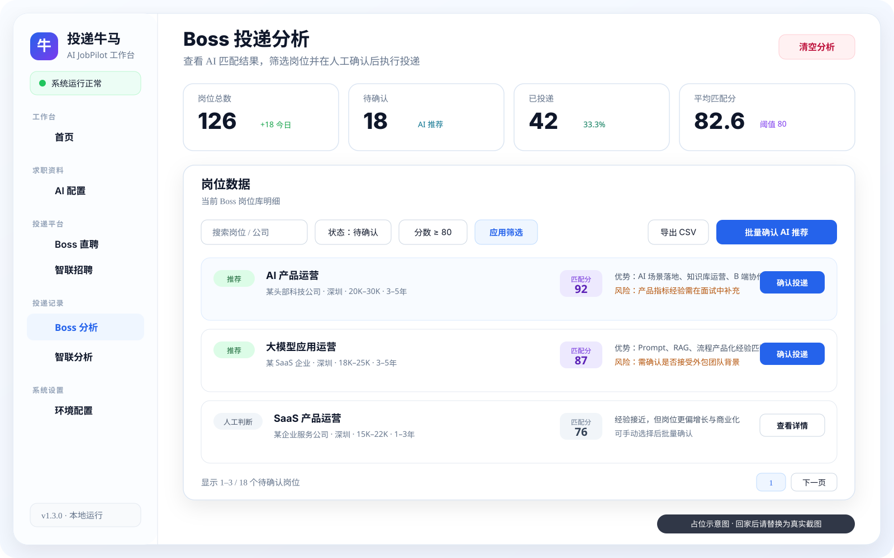

<div align="center">

# AI JobPilot

**A local-first, human-in-the-loop AI workspace for job searching.**  
Collect job listings, analyze fit, review suggested actions, and track application results from one place.

[简体中文](README.md) · [Quick Start](#quick-start) · [Downloads](docs/releases.md) · [Documentation](docs/README.md) · [Roadmap](ROADMAP.md) · [Security](SECURITY.md)

[](CHANGELOG.md)
[](WINDOWS_SETUP.md)
[](build.gradle.kts)
[](front/package.json)
[](https://github.com/damingishere-coder/AI-JobPilot/actions/workflows/ci.yml)
[](https://github.com/damingishere-coder/AI-JobPilot/actions/workflows/codeql.yml)
[](https://github.com/damingishere-coder/AI-JobPilot/actions/workflows/release.yml)
[](LICENSE)

</div>


> AI JobPilot does not bypass sign-in checks, CAPTCHAs, anti-abuse controls, or platform limits. Jobs enter a review queue first, and the user decides whether an application action should proceed.

## Why AI JobPilot

Job searching involves more than discovering vacancies. Candidates repeatedly filter listings, compare requirements with their resume, switch between platforms, and track what happened after each application.

AI JobPilot brings these steps into a local workspace:

- **Reduce repetitive screening** with resume- and preference-based job analysis.
- **Keep the user in control** by placing matched jobs in a review queue before application actions.
- **Reuse existing browser sessions** through a local Chrome Bridge instead of storing platform cookies in project configuration.
- **Keep personal data local** with SQLite-based profiles, jobs, tasks, and result tracking.
- **Understand failures** through status views, filters, statistics, and diagnostic information.

## How it works


## Product preview

> These illustrations are temporary placeholders based on the current frontend code. Replace them with real screenshots later while keeping the same filenames, and the README links will continue to work.

### Application dashboard


### Boss Zhipin collection


### AI analysis and human review



### AI configuration and candidate profile


## Core capabilities

- Multiple candidate profiles, resume text, preferences, model configuration, platform settings, and blacklists.
- Chrome Bridge collection for Boss Zhipin and Zhaopin using an already authenticated browser page.
- AI-assisted job fit analysis, scoring, filtering, and review queues.
- Human confirmation before single or batch application actions.
- Local SQLite persistence for jobs, task states, statistics, and failure reasons.
- Windows launch scripts, Docker support, and manual development commands.

## Platform support

| Platform | Collection | AI analysis | Human review | Current status |
| --- | :---: | :---: | :---: | --- |
| Boss Zhipin | ✅ | ✅ | ✅ | Main Chrome Bridge flow; limited API POC and page fallback collection |
| Zhaopin | ✅ | ✅ | ✅ | Main Chrome Bridge flow |
| Liepin | 🟡 | ✅ | ✅ | Basic local flow; adapter work is ongoing |
| 51job | 🟡 | ✅ | ✅ | Basic local flow; adapter work is ongoing |

`✅` means the current primary workflow is supported. `🟡` means basic functionality exists but coverage and stability still need validation.

## Downloads and releases

The GitHub Release workflow runs backend tests, frontend lint and build, Chrome extension validation, and SHA256 generation before publishing a tagged version.

Current automated artifacts are:

```text
AI-JobPilot-vX.Y.Z.jar
AI-JobPilot-vX.Y.Z-chrome-extension.zip
AI-JobPilot-vX.Y.Z-frontend-static.zip
AI-JobPilot-vX.Y.Z-source.zip
SHA256SUMS.txt
```

These are technical preview artifacts, **not yet a complete Windows installer that removes the Java, Node.js, and pnpm requirements**. See [docs/releases.md](docs/releases.md) for artifact details, checksum instructions, and release boundaries.

Published versions are available from [GitHub Releases](https://github.com/damingishere-coder/AI-JobPilot/releases).

## Quick start

### Windows

Requirements:

- Windows 10 or 11
- Java 21
- Node.js 20.19 or newer
- pnpm
- Chrome
- Git

After cloning the repository, run from the project root:

```text
start_windows.bat
```

Or use PowerShell:

```powershell
.\start_windows.ps1
```

Open the workspace and health endpoint:

```text
Frontend: http://localhost:6866
Backend health: http://localhost:8888/api/health
```

The basic setup is ready when the dashboard checks pass and the health endpoint returns `UP`.

See [WINDOWS_SETUP.md](WINDOWS_SETUP.md) for the full beginner setup and troubleshooting guide.

### Docker

With Docker Desktop installed, run:

```powershell
.\start_docker.ps1
```

Or double-click:

```text
start_docker.bat
```

Copy local configuration from `.env.example`. Never commit real API keys, account credentials, cookies, resume files, or browser profiles.

## Chrome Bridge setup

1. Open `chrome://extensions/`.
2. Enable Developer mode.
3. Choose **Load unpacked**.
4. Select the repository's `chrome-extension` directory.
5. Open `http://localhost:6866` and verify that the extension is connected.
6. Sign in to the supported recruitment platform in Chrome, then start collection from the workspace.

The extension supports the local workflow only. It does not bypass platform verification or usage limits.

## Development

Backend:

```powershell
.\gradlew.bat bootRun
```

Frontend:

```powershell
cd front
pnpm install
pnpm dev
```

Checks:

```powershell
.\gradlew.bat test
.\gradlew.bat build

cd front
pnpm lint
```

## Privacy and security

AI JobPilot is designed for personal, local use and should not be exposed directly as a public multi-user service.

Do not commit:

- `.env` files, API keys, passwords, cookies, or tokens
- Local SQLite databases or backups
- Resumes, screenshots, chat records, or other personal data
- Chrome profiles, browser caches, or Playwright caches

The default database path is:

```text
db/getjobs.db
```

Read [SECURITY.md](SECURITY.md) before reporting a security issue or sharing diagnostics.

## Current limitations

- Recruitment website changes can break selectors and collection logic.
- Stability is not guaranteed for every platform, account, region, or listing type.
- The project does not bypass authentication, CAPTCHAs, anti-abuse controls, or application rate limits.
- OpenClaw integration remains experimental and is not required for the primary Windows workflow.
- The current product is a Windows-focused single-user local application, not a hosted SaaS platform.
- Release automation is available, but a full Windows installer without development prerequisites is not finished yet.

## Documentation

| Document | Purpose |
| --- | --- |
| [docs/README.md](docs/README.md) | Unified navigation for usage, development, security, demo, and release documents |
| [WINDOWS_SETUP.md](WINDOWS_SETUP.md) | Windows installation, startup, verification, and troubleshooting |
| [TASK_FLOW.md](TASK_FLOW.md) | End-to-end flow from resume configuration to reviewed application actions |
| [docs/releases.md](docs/releases.md) | Release artifacts, versioning, and SHA256 verification |
| [ARCHITECTURE.md](ARCHITECTURE.md) | Architecture, module responsibilities, and data flow |
| [SECURITY.md](SECURITY.md) | Local data, cookies, API keys, and security boundaries |
| [ROADMAP.md](ROADMAP.md) | Current stage, priorities, and future direction |
| [CHANGELOG.md](CHANGELOG.md) | Release history |
| [CONTRIBUTING.md](CONTRIBUTING.md) | Bug reports, feature proposals, and code contributions |

## Project status

The repository now includes backend and frontend CI, Chrome extension validation, Docker configuration validation, CodeQL security analysis, Dependabot maintenance, and validated Release artifacts.

The next priorities are the unified platform adapter, offline Demo mode, a complete Windows distribution, and carefully scoped communication or interview-assistance capabilities that preserve platform compliance and human confirmation. See [ROADMAP.md](ROADMAP.md).

## Contributing

Bug reports, documentation improvements, reproducible platform issues, and adapter contributions are welcome. Please read [CONTRIBUTING.md](CONTRIBUTING.md) before opening a pull request.

Never post real credentials, cookies, API keys, resumes, or personal account information in a public issue.

## License

This repository uses the custom **TOUDI NIUMA Non-Commercial License 1.0**.

Non-commercial use, copying, modification, and distribution are allowed when attribution and the license notice are retained. Commercial use, paid hosting, commercial product integration, or paid consulting requires authorization from the copyright owner. See [LICENSE](LICENSE) for the full terms.

## Disclaimer

This project is intended for personal job-search assistance, technical research, and learning. Users are responsible for complying with recruitment platform rules and applicable laws, and for all actions performed with their accounts and data.
